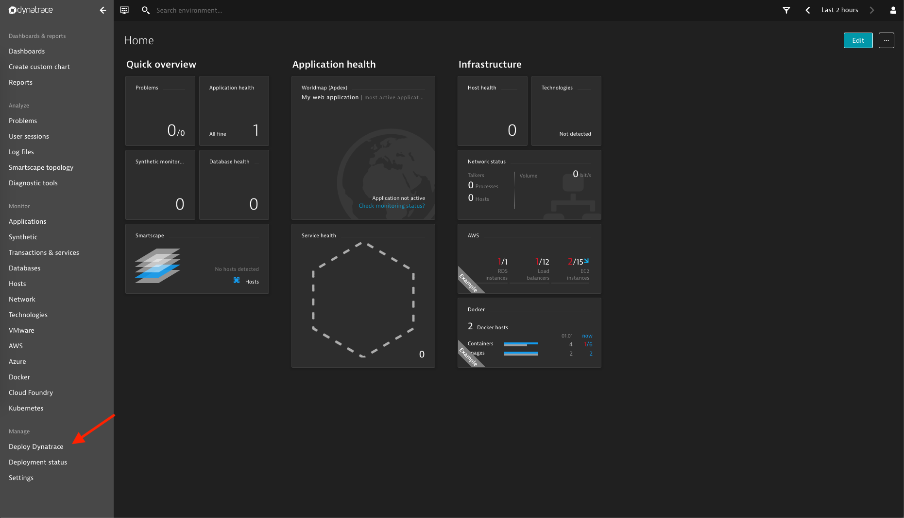
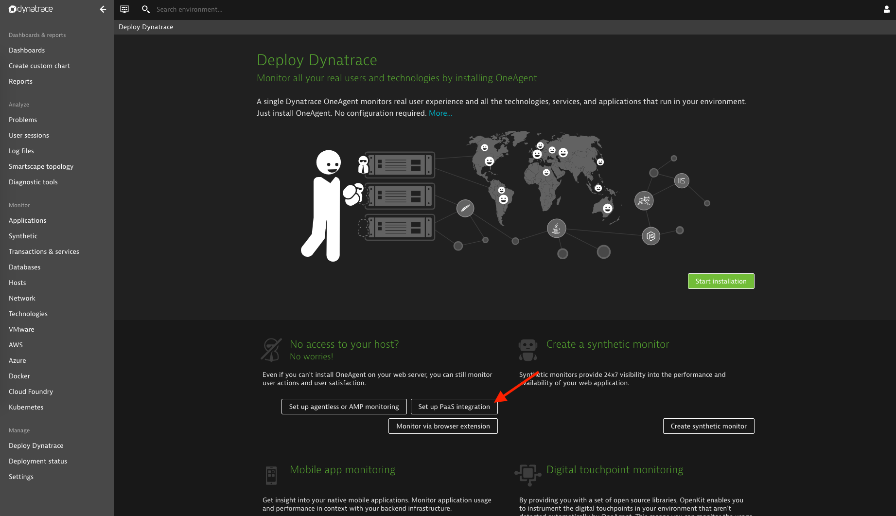
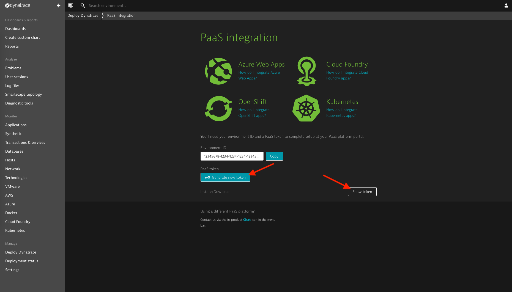

# Containerized Environment ActiveGates
Here you can find instructions on how to configure and deploy an Environment ActiveGate on Kubernetes or Cloud Foundry.

## Kubernetes
### Configuration
Edit `helm/values.yaml`

|Option|Description|
|-|-|
|docker.repository|repository containing the image|
|docker.image|executable image containing the ActiveGate installation files|
|docker.secret.username|username used to download the image from a private repository|
|docker.secret.password|password or token used to download the image from a private repository|
|replicas|how many ActiveGate instances should be created|
|env.DT_API_URL|API URL of the Dynatrace cluster which the ActiveGate will connect to ([instructions](#dt_api_url))|
|env.DT_PAAS_TOKEN|required for API access ([instructions](#dt_paas_token))|
|dumps.enabled|configure the ActiveGate to allow memory dump creation/storage|
|dumps.storage|how much space should be reserved for memory dumps|
|dumps.pvc.enabled|use a PVC instead of local storage|
|dumps.pvc.existing|reuse an existing PVC instead of creating a new one|
|dumps.host|public endpoint that can be used to download memory dumps|
|tls.cert|TLS certificate used by the Ingress|
|tls.cert|TLS key used by the Ingress|

## Installation
`helm install --name <deployment name> helm`

### Limitations
- The OneAgent has to be deployed on the same cluster to allow traffic routing via the internal network.
- All Pods should have access to the same Persistent Volume Claim. This can be problematic if the instances run on multiple nodes. Check if your resource provider supports the access mode 'ReadWriteMany' otherwise all instances should run on the same node. A list of the supported access modes ordered by resource provider is available [here](https://kubernetes.io/docs/concepts/storage/persistent-volumes/#access-modes).

### Troubleshooting
- `pod has unbound immediate PersistentVolumeClaims`
  - Restart the Pods by scaling the replica set to 0.
- `Error: release activegate failed: namespaces "default" is forbidden: User "system:serviceaccount:kube-system:default" cannot get resource "namespaces" in API group "" in the namespace "default"`
  - Solution: Run `helm init` and follow the instructions outlined in [this comment](https://github.com/helm/helm/issues/3130#issuecomment-372931407).
  
## Cloud Foundry
### Configuration
Edit `manifest.yaml`

|Option|Description|
|-|-|
|name|give your application a name (e.g. activegate)|
|disk_quota|at least 3G, more if memory dumps should be supported locally|
|memory|leave at 2G|
|instances|leave at 1|
|routes.route|public endpoint that can be used to download memory dumps|
|docker.image|executable image containing the ActiveGate installation files|
|docker.secret.username|username used to download the image from a private repository|
|env.DT_API_URL|API URL of the Dynatrace cluster which the ActiveGate will connect to ([instructions](#dt_api_url))|
|env.DT_PAAS_TOKEN|required for API access ([instructions](#dt_paas_token))|
|env.DT_DUMP_STORAGE|how many GB of storage should be reserved for memory dumps (setting this to 0 will disable memory dumps)|
|health-check-type|should be `http`|
|health-check-http-endpoint|should be `/rest/health`|
|services|connect dynatrace-monitoring to monitor the ActiveGate or fs-storage for persistent memory dump storage|

### Installation
`CF_DOCKER_PASSWORD=<Docker password/token> cf push`

### Troubleshooting
- `cf push` times out
  - Solution: Overwrite the default timeout by setting `CF_STARTUP_TIMEOUT=15` (or higher depending on your connection)

## Environment Variables
### DT_API_URL
1. Log in to your Dynatrace environment.
1. Check the URL and provide it in this format:  
`https://<YourDynatraceServerURL>/e/<environmentID>/api`

### DT_PAAS_TOKEN
1. Log in to your Dynatrace environment.
1. Click on "Deploy Dynatrace" in the sidebar menu.

1. Click on "Set up PaaS integration".

1. Generate a new PaaS token if you don't have one already. (see below)
1. Click on "Show token".

## Limitations
- Using an ActiveGate for Private Synthetic Monitoring requires to install the ActiveGate with the flag `--enable-synthetic`. See the [documentation](https://www.dynatrace.com/support/help/how-to-use-dynatrace/synthetic-monitoring/http-monitors/installing-synthetic-enabled-activegate) for further details.
